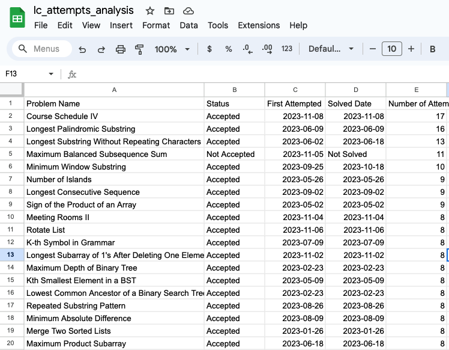

# Leetcode Submission History Analysis
This script analyzes leetcode submission history and identifies 1. challenging problems
(most attempted) and 2. previously unsolved problems. 

Attempt history is transformed into a table with the following columns: number of attempts made, submission status (`Accepted` or `Not Accepted`), the first date the problem was attempted, and the date the problem was solved, if it has been. 

| Example Analysis | 
| - | 
|  | 

### Dependencies
```
pip install pandas
```

### Instructions
1. Go to your leetcode submission history: https://leetcode.com/submissions/#/1 
2. Scrape into a CSV file named `lc_arguments.py`.
3. Run the script from the command line: 
```
python3 analyze_lc_attempts.py
```

The script succeeds if it outputs:
```
Processing complete. The output CSV is at: lc_attempts_analysis.csv
```
4. (Data Validation) Navigate to `lc_attempts_analysis.csv` and ensure data looks correct. 
5. Import collated submission history into a google spreadsheet, identify problem areas, and keep track of the additional problems attempted.
6. Rerun script when resuming preparation for coding interviews.
